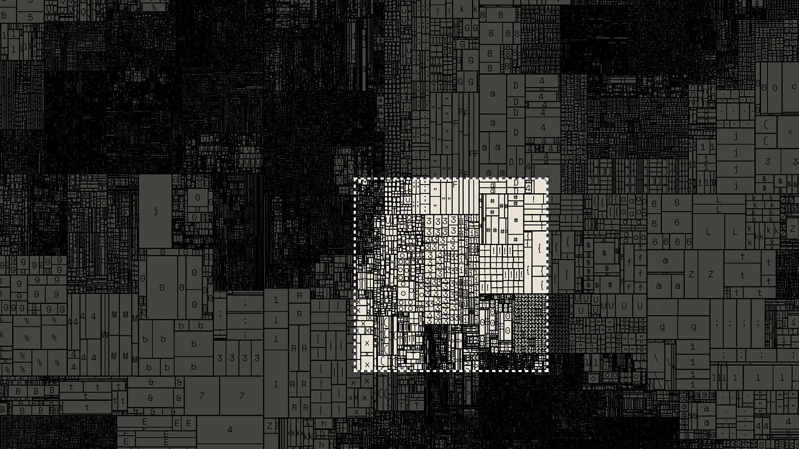

# Figma Plugin: Big Image Crop



A Figma plugin for cropping a section of a massive (e.g. print-quality) image perfectly into a Frame.

If you drag and drop a huge image into Figma, it will load the entire thing, and down-scale it to 4k max dimension. If the image is print quality, and you want to crop into a section of the image, you'll not be able to at the original quality of the image.

You can use this plugin to achieve high quality cropped regions in Figma. Select a Frame, such as a 16:9 slide for a presentation, drag your image into the plugin's image area, and then choose a region and click CROP. You can zoom in/out of the image viewer, move the anchors around, use shift or alt/option while dragging anchors to resize and move along axes. Use "MAX" for the higest quality (it will still be capped to Figma's 4k limits).

## Develop

```sh
npm install
npm run build      # → dist/main.js + dist/ui.html
npm run watch      # rebuild on change
npm test           # geometry / resample / PNG+ICC unit tests
```

Then in Figma: **Plugins → Development → Import plugin from manifest…** and pick `manifest.json`.

## License

MIT, see [LICENSE.md](http://github.com/mattdesl/figma-plugin-big-image-crop/blob/master/LICENSE.md) for details.
